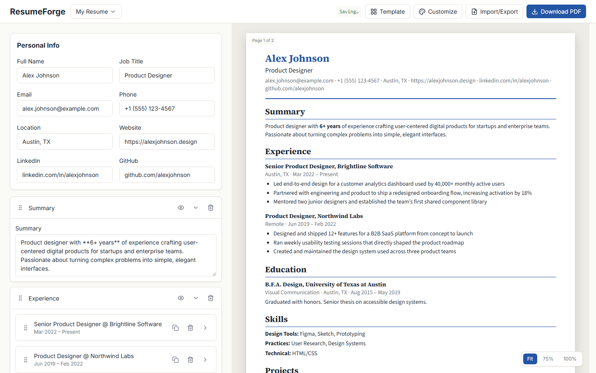
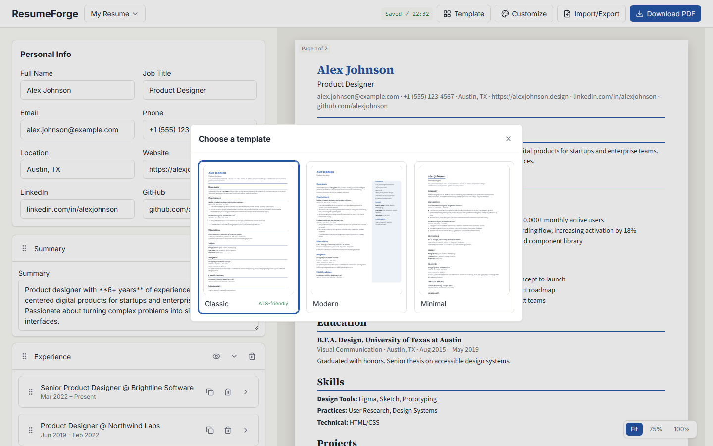
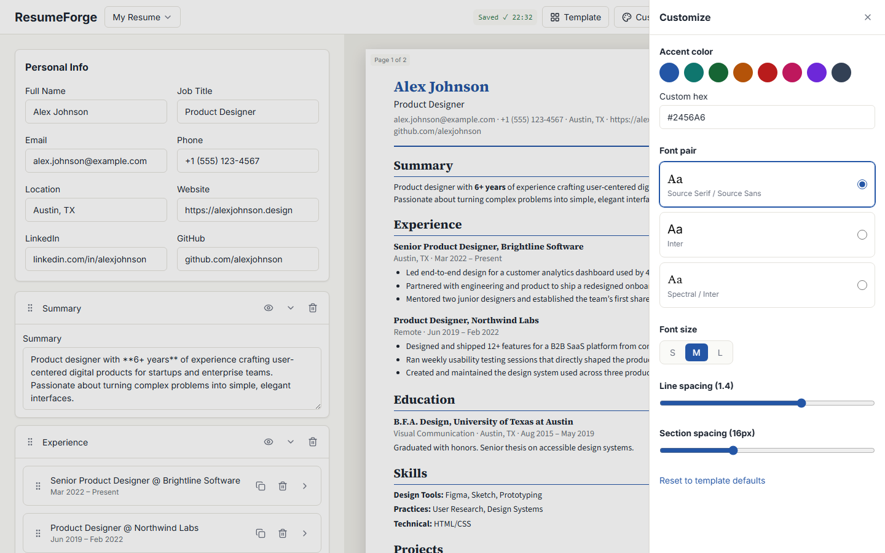

# ResumeForge

A 100% free, client-side resume builder. No accounts, no backend, no database, no analytics — nothing you type ever leaves your device.



## Features

- **Three ATS-friendly templates** — Classic, Modern, Minimal — switch anytime without losing content
- **Drag-and-drop section and entry reordering**, fully keyboard-operable (dnd-kit's keyboard sensor: Space to lift, arrows to move)
- **Markdown-lite descriptions** (`**bold**`, `*italic*`, bullet lists) rendered through a hand-written, whitelist-only parser — no HTML injection surface
- **Customize panel**: accent color (curated swatches or a custom hex, with a contrast warning), font pairing, font size, line/section spacing
- **PDF export via your browser's native print dialog** (`window.print()` + print CSS) — real, selectable text, not a rasterized image, so it stays ATS-parseable
- **JSON export/import** for backups or moving a resume between devices, fully schema-validated on import
- **Multiple resumes**, each with independent styling
- **Works offline** after the first load — every asset (including fonts) is self-hosted; nothing is fetched from a CDN or third-party server, ever

## Screenshots

| Editor & live preview | Template gallery | Customize panel |
| --- | --- | --- |
|  |  |  |

## Stack

Vite + React 18 + TypeScript + Tailwind CSS + Zustand + dnd-kit. PDF export uses print CSS (`window.print()`), not canvas rasterization, so exported text stays selectable and ATS-friendly. See [`docs/02-Technical-Architecture-Document.md`](docs/02-Technical-Architecture-Document.md) for the full architecture.

## Development

```bash
npm install
npm run dev      # start dev server
npm run build    # production build
npm test         # run unit tests
npm run lint     # lint
```

## Deployment

ResumeForge is a static site — no server, no environment variables, no database. It deploys to any static host; `vercel.json` and `netlify.toml` are already checked in with the recommended security headers (CSP, HSTS, `X-Frame-Options`, etc. — see [`docs/03-Security-Access-Document.md`](docs/03-Security-Access-Document.md) §4.2).

**Vercel:** import the repo at [vercel.com/new](https://vercel.com/new) — it auto-detects the Vite build (`npm run build`, output directory `dist`).

**Netlify:** import the repo at [app.netlify.com/start](https://app.netlify.com/start) with build command `npm run build` and publish directory `dist`.

Either free tier is enough — there's no backend to scale.

## Privacy

ResumeForge stores everything **only in your browser's `localStorage`**. Specifically:

- No account, no sign-in, no email collection.
- No analytics, no telemetry, no tracking scripts of any kind.
- No data — your name, work history, or anything else you type — is ever sent to a server. The app makes zero network requests once the page has loaded (verified in DevTools' Network tab; see `docs/DECISIONS.md`, RB-044).
- "Delete all my data" (in the Import/Export menu) permanently clears everything from `localStorage` in one action.
- Exporting a JSON backup or a PDF happens entirely on your device; nothing is uploaded anywhere.
- If your browser's storage is ever cleared (private browsing, "clear site data", a new device), your resumes go with it — export a JSON backup first if you want a copy elsewhere.
